# COMPLETE MATPLOTLIB TRAINING

- Matplotlib is a low level graph plotting library in python that serves as a visualization utility.
- Matplotlib was created by John D. Hunter.
- Matplotlib is open source and we can use it freely.

## Installation of Matplotlib

If you have Python and PIP already installed on a system, then installation of Matplotlib is very easy.

Install it using this command:

```bash
C:\Users\Your Name>pip install matplotlib
```

## Import Matplotlib

Once Matplotlib is installed, import it in your applications by adding the import module statement:

```python
import matplotlib
```

## Checking Matplotlib Version

The version string is stored under __version__ attribute.

### Example

```python
import matplotlib
print(matplotlib.__version__)
```

## Matplotlib Pyplot

The most commonly used module in matplotlib is pyplot.

```python
import matplotlib.pyplot as plt
```

Now the Pyplot package can be referred to as plt.

## Simple One Liner Graph

```python
import matplotlib.pyplot as plt

# x and y are the data points.
x = [1, 2, 3, 4, 5]
y = [10, 20, 30, 40, 50]

# plt.plot(x,y) is used to draw the line.
plt.plot(x,y)

# Parameter 1 is an array containing the points on the x-axis.
# Parameter 2 is an array containing the points on the y-axis.

# plt.show() is used to display the graph.
plt.show()
```

### Output

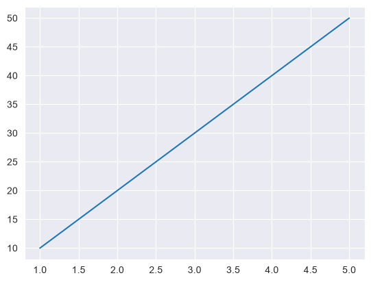

## Plotting Without Line

To plot only the markers, you can use shortcut string notation parameter 'o', which means 'rings'.

<!-- markdownlint-disable MD024 -->
### Example
<!-- markdownlint-enable MD024 -->
```python
import matplotlib.pyplot as plt

# x and y are the data points.
x = [1, 2, 3, 4, 5]
y = [10, 20, 30, 40, 50]

# plt.plot(x,y) is used to draw the line.
plt.plot(x,y, 'o')  # Note here: 'o' is added right after x and y

# plt.show() is used to display the graph.
plt.show()
```
<!-- markdownlint-disable MD024 -->
### Output
<!-- markdownlint-enable MD024 -->

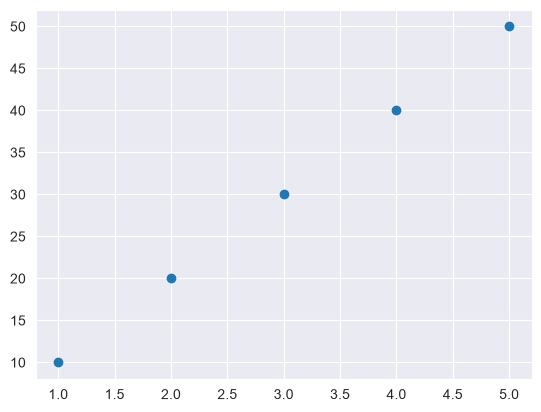

## Multiple lines in one graph

We can plot more than one line on the same graph to compare multiple datasets.

<!-- markdownlint-disable MD024 -->
### Example
<!-- markdownlint-enable MD024 -->

```python
import matplotlib.pyplot as plt 
x  = [1, 2, 3, 4, 5]
y1 = [10, 20, 30, 40, 50]
y2 = [50, 40, 30, 20, 10]
y3 = [15, 25, 35, 45, 55]
y4 = [17, 83, 83, 66, 98]
plt.plot(x, y1)
plt.plot(x, y2)
plt.plot(x, y3)
plt.plot(x , y4)
plt.show()
```

<!-- markdownlint-disable MD024 -->
### Output
<!-- markdownlint-enable MD024 -->
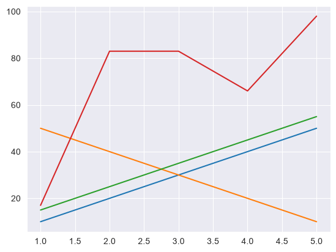

## Matplotlib Markers

You can use the keyword argument marker to emphasize each point with a specified marker:
<!-- markdownlint-disable MD024 -->
### Example
<!-- markdownlint-enable MD024 -->

```python
import matplotlib.pyplot as plt
x  = [1, 2, 3, 4, 5]
y1 = [10, 20, 30, 40, 50]
plt.plot(x, y1 , marker = 'o')
plt.show()
```

<!-- markdownlint-disable MD024 -->
### Output
<!-- markdownlint-enable MD024 -->
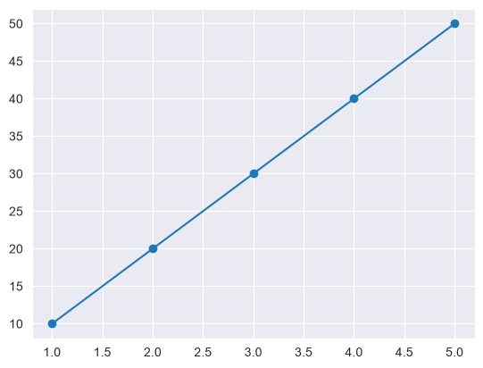

## Marker Reference

You can choose any of these markers:

| Shape | Markers | Description |
| :---: | :---: | :--- |
| Circles | 'o' | Circle |
| Stars | '*' | Star |
| Points | '.' ',' | Point, Pixel |
| X shapes | 'x' 'X' | X, X (filled) |
| Plus | '+' 'P' | Plus, Plus (filled) |
| Squares | 's' | Square |
| Diamonds | 'D' 'd' | Diamond, Diamond (thin) |
| Triangles | 'v' '^' '<' '>' '1' '2' '3' '4' | All triangle variants |
| Others | 'p' 'H' 'h' '_' | Pentagon, Hexagon, Hline |

## Format Strings fmt

You can also use the shortcut string notation parameter to specify the marker.

This parameter is also called fmt, and is written with this syntax:

`
marker|line|color
`

<!-- markdownlint-disable MD024 -->
### Example
<!-- markdownlint-enable MD024 -->

```python
import matplotlib.pyplot as plt

y = [3, 8, 1, 10]

plt.plot(y, 'o:r')
plt.show()
```

<!-- markdownlint-disable MD024 -->
### Output
<!-- markdownlint-enable MD024 -->
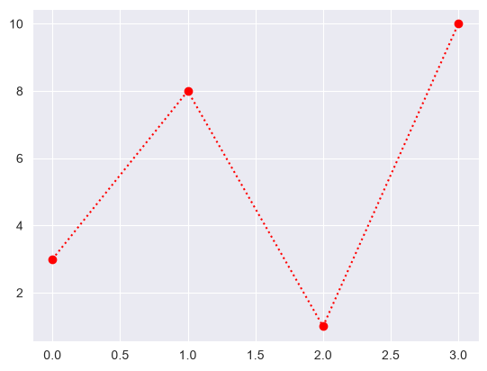

The marker value can be anything from the Marker Reference above.

The line value can be one of the following:

| Line Syntax | Description         |
| :---------: | :----------:        |
| `'-'`       | Solid line          |
| `':'`       | Dotted line         |
| `'--'`      | Dashed line         |
| `'-.'`      | Dashed/dotted line  |

__Note:__ If you leave out the line value in the fmt parameter, no line will be plotted.

The short color value can be one of the following:

## Color Reference

| Color Syntax | 'r' | 'g' | 'b' | 'c' | 'm' | 'y' | 'k' | 'w' |
| :----------: | :-: | :-: | :-: | :-: | :-: | :-: | :-: | :-: |
| Description | Red | Green | Blue | Cyan | Magenta | Yellow | Black | White |

## Marker Size

You can use the keyword argument markersize or the shorter version, ms to set the size of the markers:

<!-- markdownlint-disable MD024 -->
### Example
<!-- markdownlint-enable MD024 -->

```python
import matplotlib.pyplot as plt
x  = [1, 2, 3, 4, 5]
y1 = [10, 20, 30, 40, 50]
plt.plot(x, y1 , marker = 'o', markersize = 20)
plt.show()
```

<!-- markdownlint-disable MD024 -->
### Output
<!-- markdownlint-enable MD024 -->
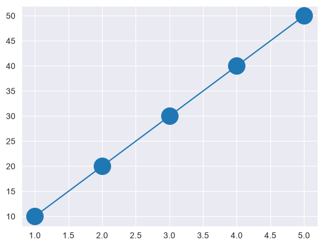

## Marker Edge Color

You can use the keyword argument markeredgecolor or the shorter mec to set the color of the edge of the markers:

<!-- markdownlint-disable MD024 -->
### Example
<!-- markdownlint-enable MD024 -->

```python
import matplotlib.pyplot as plt
x  = [1, 2, 3, 4, 5]
y1 = [10, 20, 30, 40, 50]
plt.plot(x, y1 , marker = 'o', 
         markeredgecolor = 'red', markersize = 20)
plt.show()
```

<!-- markdownlint-disable MD024 -->
### Output
<!-- markdownlint-enable MD024 -->
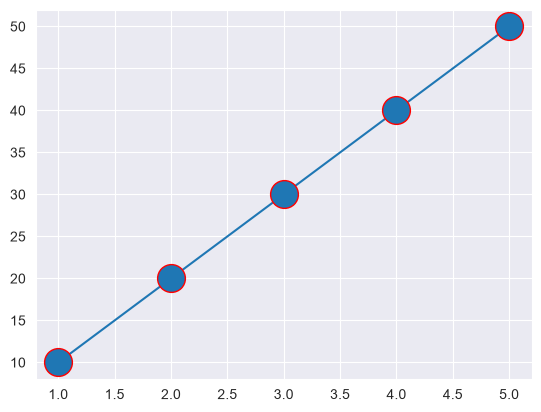

## Marker Face Color

You can use the keyword argument markerfacecolor or the shorter mfc to set the color inside the edge of the markers:

<!-- markdownlint-disable MD024 -->
### Example
<!-- markdownlint-enable MD024 -->

```python
import matplotlib.pyplot as plt
x  = [1, 2, 3, 4, 5]
y1 = [10, 20, 30, 40, 50]
plt.plot(x, y1 , marker = 'o', 
         markeredgecolor = 'red', 
         markerfacecolor = 'yellow', 
         markersize = 20)
plt.show()
```

<!-- markdownlint-disable MD024 -->
### Output
<!-- markdownlint-enable MD024 -->
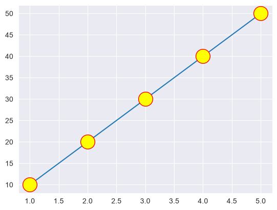

[colors]: https://www.w3schools.com/colors/colors_names.asp

For more color details [visit][colors]

<!-- markdownlint-disable MD024 -->
## Matplotlib Line
<!-- markdownlint-enable MD024 -->
You can use the keyword argument linestyle, or shorter ls, to change the style of the plotted line:

| Style | 'solid' (default) | 'dotted' | 'dashed' | 'dashdot' | 'None' |
| :----: | :---------------: | :------: | :------: | :-------: | :----: |
| Or | `'-'` | `':'` | `'--'` | `'-.'` | `''` or `' '` |

## Dotted Line

```python
import matplotlib.pyplot as plt
x  = [1, 2, 3, 4, 5]
y1 = [10, 20, 30, 40, 50]

plt.plot(x, y1 , marker = 'o',
         markeredgecolor = 'red',
         markerfacecolor = 'yellow',
         markersize = 12,
         linestyle =":",
         label= 'Dotted line',
         color = 'pink',
         linewidth = 2)

plt.legend()
plt.show()
```
<!-- markdownlint-disable MD024 -->
### Output
<!-- markdownlint-enable MD024 -->

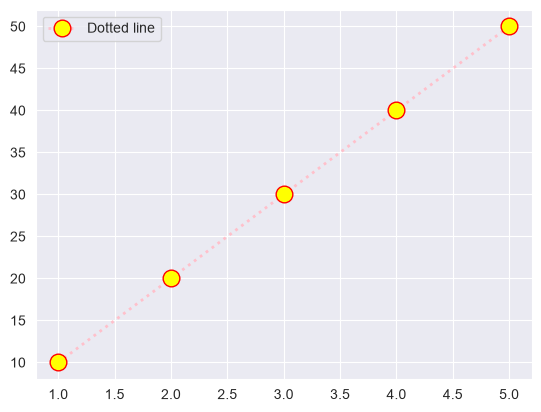

## Solid Line

```python
import matplotlib.pyplot as plt
x  = [1, 2, 3, 4, 5]
y1 = [10, 20, 30, 40, 50]

plt.plot(x, y1 , marker = 'o',
         markeredgecolor = 'red',
         markerfacecolor = 'yellow',
         markersize = 12,
         linestyle ="-",            # controls the style of line
         label= 'Solid line',       # sets the color of line
         color = 'black',           # sets the thickness of line
         linewidth = 2)

plt.legend()                        # Show Legend
plt.show()
```

<!-- markdownlint-disable MD024 -->
## Output
<!-- markdownlint-enable MD024 -->

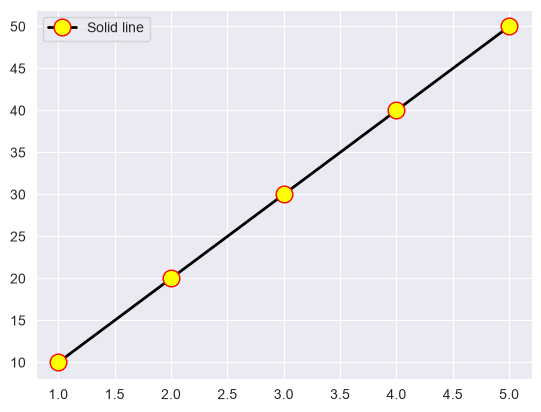

## Dashed Line

```python
import matplotlib.pyplot as plt
x  = [1, 2, 3, 4, 5]
y1 = [10, 20, 30, 40, 50]

plt.plot(x, y1 , marker = 'o',
         markeredgecolor = 'red',
         markerfacecolor = 'yellow',
         markersize = 12,
         linestyle ="--",           # controls the style of line
         label= 'Dashed line',
         color = 'black',           # sets the color of line
         linewidth = 2)             # sets the thickness of line

plt.legend()                        # Show Legend
plt.show()
```
<!-- markdownlint-disable MD024 -->
## Output
<!-- markdownlint-enable MD024 -->

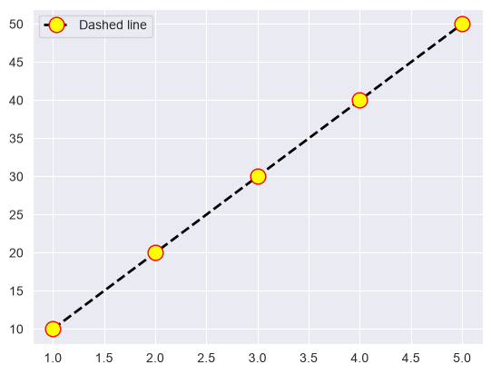

## Dash-Dot Line

```python
import matplotlib.pyplot as plt
x  = [1, 2, 3, 4, 5]
y1 = [10, 20, 30, 40, 50]

plt.plot(x, y1 , marker = 'o',
         markeredgecolor = 'red',
         markerfacecolor = 'yellow',
         markersize = 12,
         linestyle ="-.",        # controls the style of line
         label= 'Dash-Dot line',
         color = 'black',        # sets the color of line
         linewidth = 2)          # sets the thickness of line

plt.legend()                     # Show Legend
plt.show()
```
<!-- markdownlint-disable MD024 -->
## Output
<!-- markdownlint-enable MD024 -->

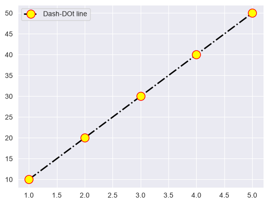

## Matplotlib Labels and Title

- With Pyplot, you can use the xlabel() and ylabel() functions to set a label for the x- and y-axis.
- With Pyplot, you can use the title() function to set a title for the plot.

<!-- markdownlint-disable MD024 -->
### Example
<!-- markdownlint-enable MD024 -->

```python
import matplotlib.pyplot as plt

x = [80, 85, 90, 95, 100, 105, 110, 115, 120, 125]
y = [240, 250, 260, 270, 280, 290, 300, 310, 320, 330]

plt.plot(x, y, marker = 'o', markersize = 7,
        markerfacecolor = 'yellow',
        markeredgecolor= 'red')

plt.title("Average Pulse Calorie Burnage")
plt.xlabel("Pulse")
plt.ylabel("Calorie")

plt.show()
```

<!-- markdownlint-disable MD024 -->
## Output
<!-- markdownlint-enable MD024 -->

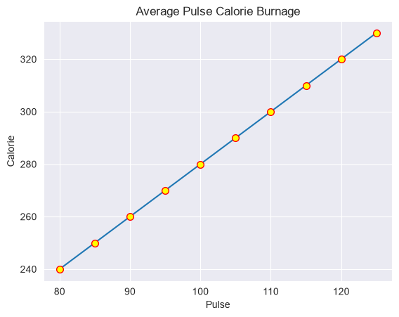

## Set Font Properties for Title and Labels

You can use the fontdict parameter in xlabel(), ylabel(), and title() to set font properties for the title and labels.

<!-- markdownlint-disable MD024 -->
### Example
<!-- markdownlint-enable MD024 -->

```python
import matplotlib.pyplot as plt

x = [80, 85, 90, 95, 100, 105, 110, 115, 120, 125]
y = [240, 250, 260, 270, 280, 290, 300, 310, 320, 330]

font1 = {'family':'oswald','color':'green','size':20}
font2 = {'family':'Times New Roman','color':'red','size':15}

plt.title("Sports Watch Data", fontdict = font1)
plt.xlabel("Average Pulse", fontdict = font2)
plt.ylabel("Calorie Burnage", fontdict = font2)

plt.plot(x, y, marker = 'o', mfc='red', mec = 'yellow')
plt.show()
```

<!-- markdownlint-disable MD024 -->
## Output
<!-- markdownlint-enable MD024 -->

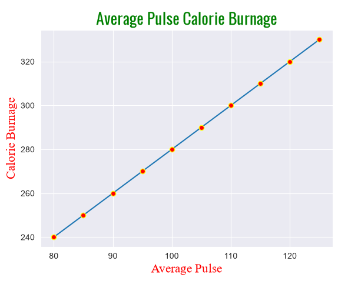

## Position the Title

- You can use the loc parameter in title() to position the title.
- Legal values are: 'left', 'right', and 'center'. Default value is 'center'.

<!-- markdownlint-disable MD024 -->
### Example
<!-- markdownlint-enable MD024 -->
```python
import matplotlib.pyplot as plt

x = [80, 85, 90, 95, 100, 105, 110, 115, 120, 125]
y = [240, 250, 260, 270, 280, 290, 300, 310, 320, 330]

font1 = {'family':'oswald','color':'green','size':20}
font2 = {'family':'Times New Roman','color':'red','size':15}

plt.title("Sports Watch Data", fontdict = font1, loc = 'right')
plt.xlabel("Average Pulse", fontdict = font2)
plt.ylabel("Calorie Burnage", fontdict = font2)

plt.plot(x, y, marker = 'o', mfc='red', mec = 'yellow')
plt.show()
```
<!-- markdownlint-disable MD024 -->
## Output
<!-- markdownlint-enable MD024 -->

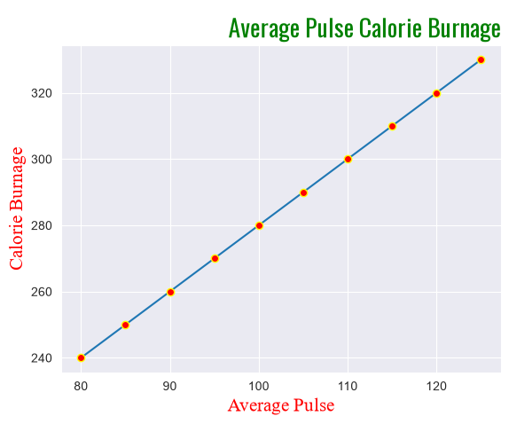

## Matplotlib Adding Grid Lines

- You can add grid line With Pyplot, to make it easier to read the values.
- you can use the grid() function to add grid lines to the plot.
- Grid lines are very useful When you want to match values on both axes.

<!-- markdownlint-disable MD024 -->
### Example
<!-- markdownlint-enable MD024 -->

```python
import matplotlib.pyplot as plt

x = [80, 85, 90, 95, 100, 105, 110, 115, 120, 125]
y = [240, 250, 260, 270, 280, 290, 300, 310, 320, 330]

font1 = {'family':'oswald','color':'green','size':20}
font2 = {'family':'Times New Roman','color':'red','size':15}

plt.title("Average Pulse Calorie Burnage", fontdict = font1, loc = 'center')
plt.xlabel("Average Pulse", fontdict = font2)
plt.ylabel("Calorie Burnage", fontdict = font2)

plt.plot(x, y, marker = 'o', mfc='red', mec = 'yellow')
plt.grid(alpha = 0.1, linestyle = '--', color = 'gray', linewidth = 0.7)

# alpha = 1 (solid grid) and alpha = 0(invisible)

plt.show()
```

<!-- markdownlint-disable MD024 -->
## Output
<!-- markdownlint-enable MD024 -->


